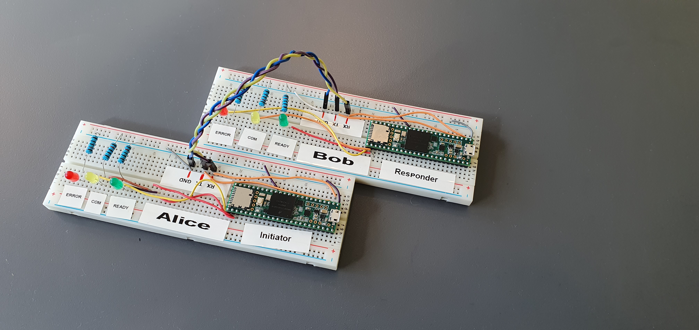

# PQCTeensy
PQCTeensy demonstrates a proof-of-concept quantum secure key exchange between two
[Teensy 3.6](https://www.pjrc.com/store/teensy36.html) development boards. The
implemented protocol is self-contained and focuses on using all the relevant signing
and key encapsulation algorithms rather than necessarily being secure.

The work was carried out by two undergraduate students during a summer internship at
[FFI](https://www.ffi.no/en), and is based on the excellent project
[pqm4](https://github.com/mupq/pqm4).

## Installation and usage
You will need two Teensy 3.6 boards, some cables and optionally LEDs and resistors.
For simplicity, we refer to the two boards as Alice and Bob.

1. Install [Arduino](https://www.arduino.cc/en/Main/Software) and [Teensyduino](https://www.pjrc.com/teensy/td_download.html).
2. Clone this repository using `$ git clone --recurse-submodules`. (Run `submodules.sh` if you cloned without the argument.)
3. Edit `Makefile` to point to your Teensyduino installation. Alternatively, you can use a different installation of `arm-none-eabi` and the Arduino libraries for Teensy 3.6. Warning: This has not been tested by us.
4. Run `make initiator`, `make responder`, or simply `make` for both.
5. Upload `initiator.hex` to Alice and `responder.hex` to Bob using the Teensy Loader. Disconnect both boards, and set up the hardware:
   * Connect the two devices using the serial1 interface at pins 0 (RX1) and 1 (TX1), as well as GND.
   * For a more visual experience, connect LEDs to pins 33 (ERROR), 34 (COM), and 35 (READY).
   * Connect the two boards to the computer(s) again using a USB cable.
6. Using a serial monitor, send a message to Alice. The boards will then complete a key exchange and initialize AES with the agreed upon key. Finally, Alice encrypts the message and sends it to Bob, who decrypts and sends the message in clear through USB.
7. You can now relay chat messages through the serial monitors.

The folder `frodokem976shake_template` contains the two header files needed to
reconstruct this parameter set from `frodokem640shake` as included in pqm4. You
may also want to modify `api.h` for ntrulpr761 and sntrup761 to include the line
`#define CRYPTO_ALGNAME "ntrulpr761"` (resp. `sntrup761`), as the program is
reading these to print which scheme is being used.

## Configuration options
To use a different pqm4 scheme, change the paths in `params.h` to the wanted
`api.h` location. Also change the path of `IMPLEMENTATION_PATH_KEM` and
`IMPLEMENTATION_PATH_SIGN` in the makefile.

To use a different AES-version, simply change name between the pointy brackets
int the declaration of gcm in `com.cpp`. The different
schemes available are found in `arduinolibs/libraries/Crypto/AES.h`.

To use the library on a different Teensy than the Teensy 3.6, some of the
flags will probably have to be changed in the makefile. This especially concerns
the `LD_SCRIPT` and `FLAGS_CPU` variables. The `BOARD_ID` also needs to be changed.

The makefile is configured to a Linux environment. In particular, the paths in
`CORE_BASE`, `GCC_BASE` and `UPL_PJRC_B` will depend on your operating system and
where you downloaded you Arduino files.
